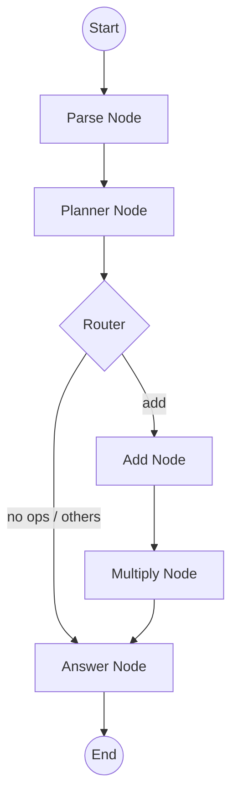

# Calculator Agent (LangGraph)

This is a modular calculator agent built using **LangGraph**, **LangChain**, and **Groq**. It decomposes a natural language math request into distinct steps and executes them through a state-driven graph.

## Architecture & Flow

The agent uses a Directed Acyclic Graph (DAG) to manage the execution state.

### Components

1.  **State (`calculator_state.py`)**: A Pydantic model that tracks the user input, extracted numbers, planned operations, intermediate steps, and the final result.
2.  **Parse Node (`parse_node.py`)**: Uses Regex to extract all numeric values from the user's input string.
3.  **Planner Node (`planner_node.py`)**: Uses an LLM (Llama 3.1 via Groq) to identify which operations (e.g., "add", "multiply") are needed based on the user's request. It is strictly instructed NOT to perform the math itself.
4.  **Router (`routing.py`)**: A conditional edge that decides whether to proceed to calculation nodes or jump straight to the answer based on the planner's output.
5.  **Calculation Nodes**:
    *   **Add Node (`add_node.py`)**: Performs addition on the first two numbers in the state.
    *   **Multiply Node (`multiply_node.py`)**: Multiplies the result of the addition by the next number in the list.
6.  **Answer Node (`answer_node.py`)**: Formulates the final response and handles error cases where calculation might have failed.

## How It Works

1.  **Initialization**: The `main.py` script initializes the `CalculatorState` with a user query like *"Add 10 and 5 then multiply by 3"*.
2.  **Parsing**: The `parse` node runs first, producing `numbers: [10, 5, 3]`.
3.  **Planning**: The `planner` node asks the LLM for a plan. Output: `operations: ["add", "multiply"]`.
4.  **Routing**: The router sees `"add"` in the operations list and directs the flow to the `add` node.
5.  **Execution**: 
    *   `add` node calculates `10 + 5 = 15`.
    *   The graph flows to `multiply` node, which calculates `15 * 3 = 45`.
6.  **Finalization**: The `answer` node captures the `final_result` and completes the graph.

## Setup

1.  Ensure you have a `.env` file with your `GROQ_API_KEY`.
2.  Install dependencies: `pip install langgraph langchain-groq loguru pydantic`.
3.  Run the agent: `python main.py`.
